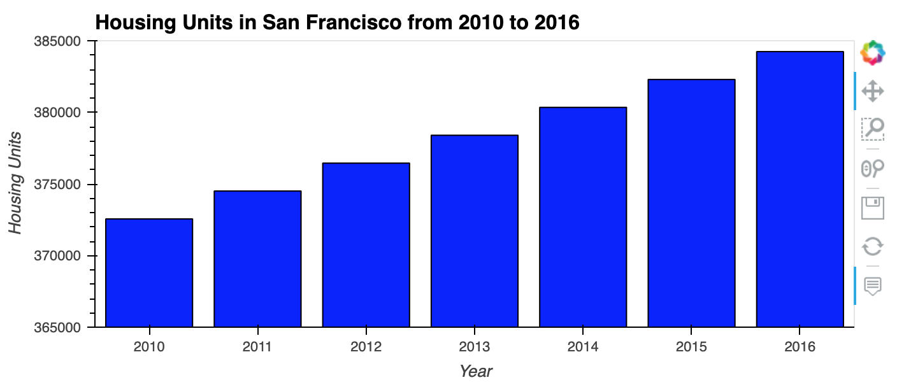
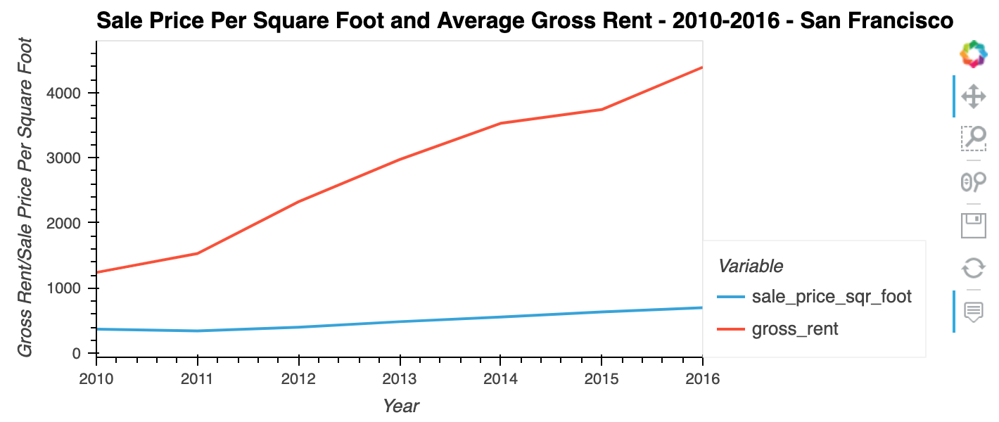
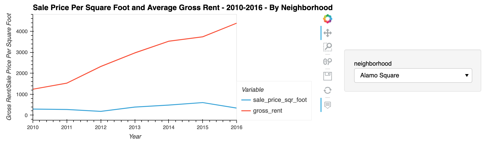
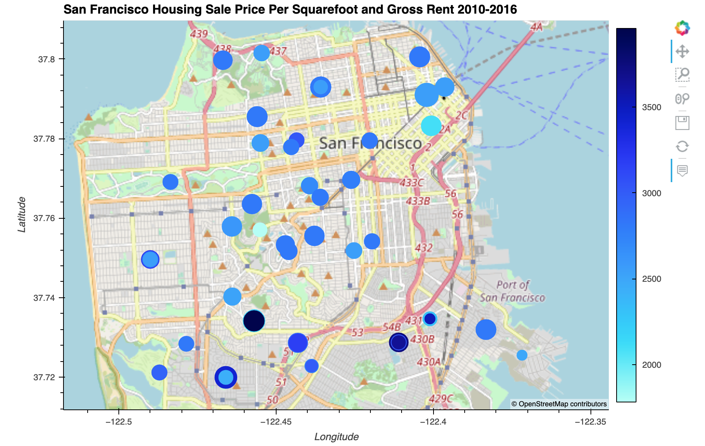

# San Francisco Real Estate Market 2010-2016

>In this Jupyter Lab, I am analyzing the possible real estate investment opportunities of San Francisco during 2010 to 2016. Property price per squarefootage and gross rental income were sorted by years and neighborhood to identify potential one-click, buy-and-rent targets.

---

## Technologies
This project leverages python 3.7 with the following packages:

* [pandas](https://pandas.pydata.org/docs/getting_started/overview.html) - To read, calculate, analysis, visualize data

* [pathlib](https://docs.python.org/3/library/pathlib.html) - For providing paths of files and directories

* [hvplot](https://hvplot.holoviz.org/) - Provide interactive visualization

* [geoviews](https://malouche.github.io/notebooks/geoviews.html) - Visualize geographical information of selected data in an interactive format

---

## Installation Guide

Before running the Jupyter notebook file, first, install the following dependencies in Terminal or Bash.

```python
  pip install pandas
  pip install pathlib
  conda install -c pyviz hvplot geoviews
```

---
## Financial analysis and visualizations includs the following:
    
* Calculate and plot the housing units per year



* Calculate and plot the average prices per square foot



* Compare the average prices by neighborhood



* Build an interactive neighborhood map



---
## Contributors

**UC Berkeley Extension**

**Yanjun Lin Andrie**

* yanjun.lin.andrie@gmail.com

* https://www.linkedin.com/in/yanjun-linked

---

## License

MIT
 
